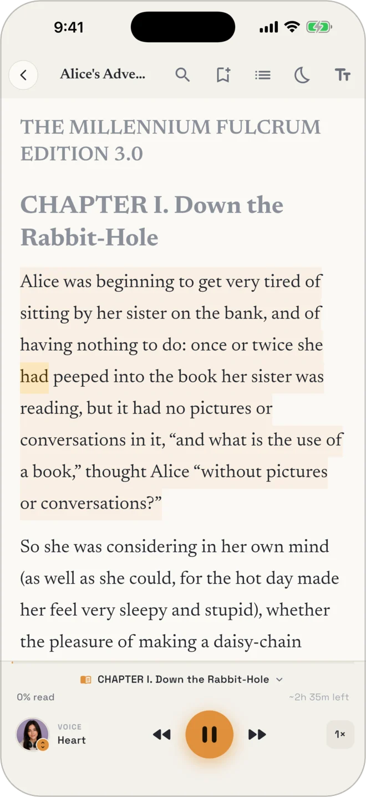
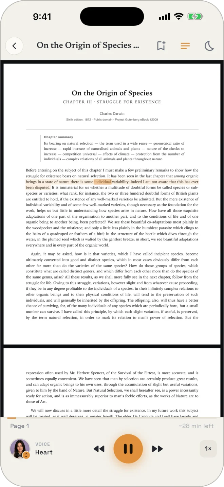
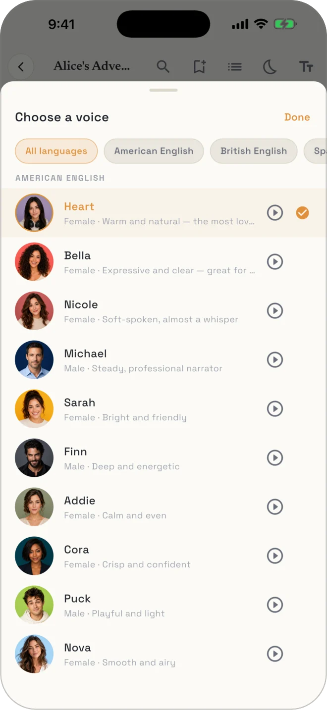
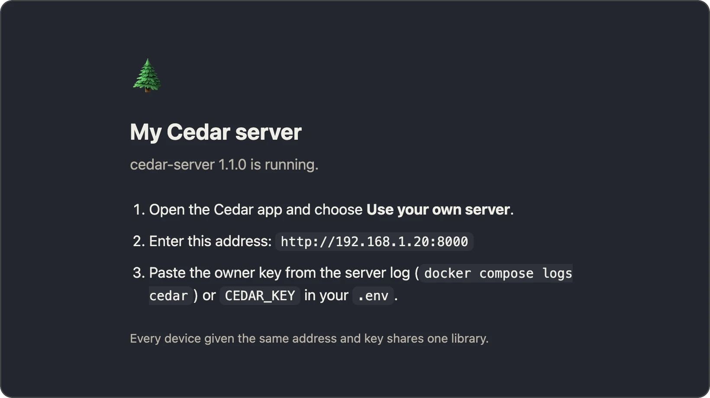
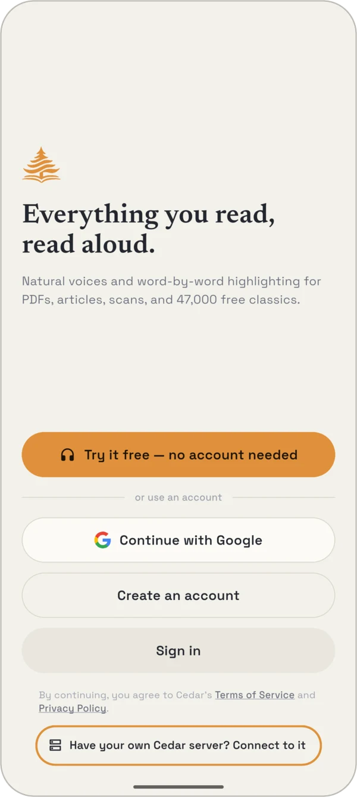
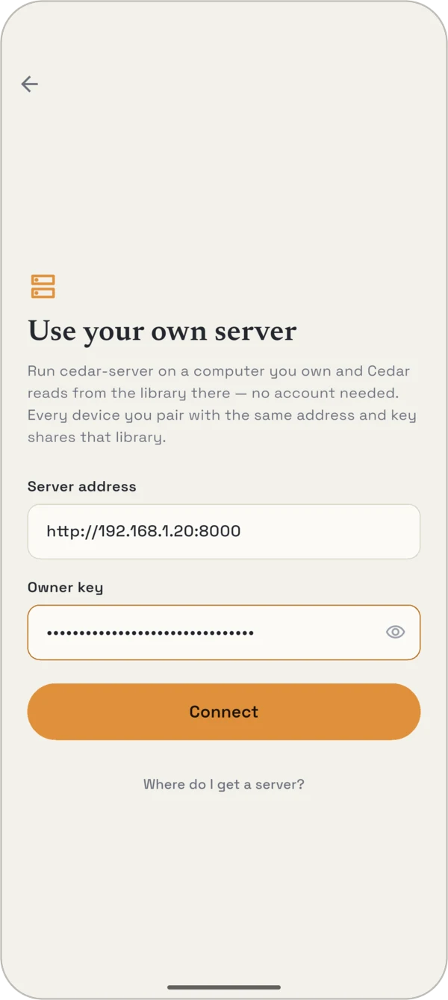
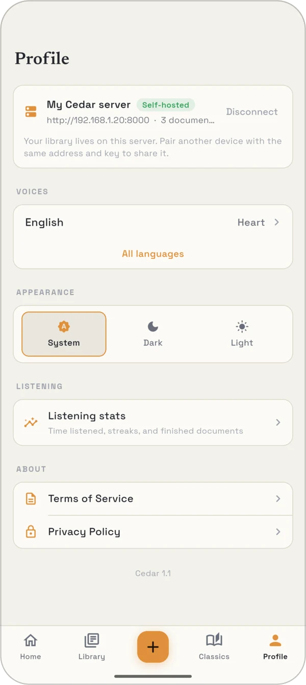
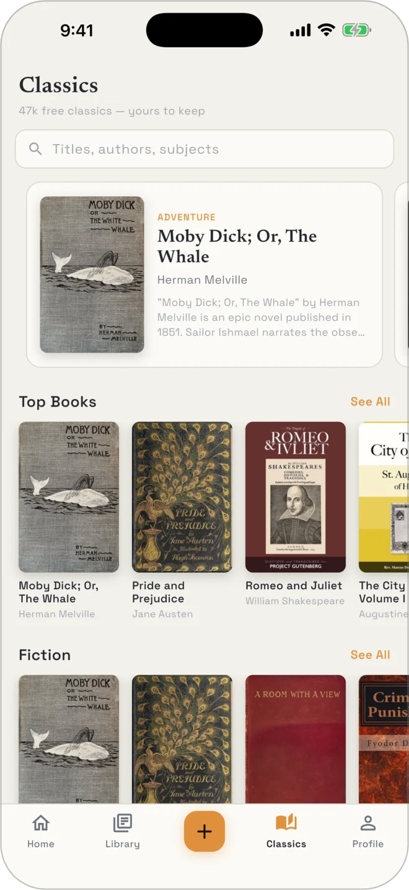

<p align="center">
  
</p>

<h1 align="center">cedar-server</h1>

<p align="center">
  Your own read-aloud server for the <a href="https://cedarreadaloud.com"><b>Cedar</b></a> app.<br>
  PDFs, EPUBs, articles and pasted text, read in natural neural voices with every word lit as it's spoken —<br>
  and the whole library living on a machine you own.
</p>

<p align="center">
  <a href="https://github.com/mlevinmail/cedar-server/actions/workflows/ci.yml"></a>
  <a href="LICENSE"></a>
  
  
</p>

<p align="center">
  <a href="#install"><b>Install</b></a> ·
  <a href="#security">Security</a> ·
  <a href="#configuration">Configuration</a> ·
  <a href="#optional-the-book-store-public-domain-classics">Book store</a> ·
  <a href="#api">API</a> ·
  <a href="#development">Development</a>
</p>

<p align="center">
  
  &nbsp;
  
  &nbsp;
  
</p>

One owner, one key, any number of devices. There are no accounts to create:
every device you give the same address and key to sees the same library,
reading positions, bookmarks and highlights.

**Get the app:** [iPhone & iPad](https://apps.apple.com/app/id6795001323) ·
[Android](https://play.google.com/store/apps/details?id=com.levinlabs.cadenceApp)

## Install

A few minutes, most of it download time. You need
[Docker](https://docs.docker.com/get-docker/) and a machine that stays on — a
Mac with Apple Silicon, a Linux box, a NAS that runs containers. A GPU is
optional.

### 1 · Start the server

```bash
git clone https://github.com/mlevinmail/cedar-server.git
cd cedar-server
docker compose up -d
```

The first run builds the image and pulls the Kokoro voice engine (~2 GB).
When it is up, `http://localhost:8000` on that machine — or its network
address from any other device — shows this:

<p align="center">
  
</p>

### 2 · Copy your owner key

```bash
docker compose logs cedar
```

```text
================================================================
  A new owner key was generated. Enter it in the Cedar app
  (Use your own server) together with this server's address:

      k3Vw…your 32-character key…Qm8

  It is saved in /data/cedar.key — keep it private.
================================================================
```

That key is the only lock on your library. Scrolled away, or the container was
recreated? `docker compose exec -u cedar cedar cat /data/cedar.key`

### 3 · Find the server's address

It is `http://<the machine's IP>:8000` — for example `http://192.168.1.20:8000`.
Not `localhost`: your phone has to find the machine on your Wi-Fi.

| On the server | Command |
|---|---|
| macOS | `ipconfig getifaddr en0` |
| Linux | `hostname -I` |
| Windows | `ipconfig` → *IPv4 Address* |

### 4 · Pair the app

<table>
  <tr>
    <td align="center" width="33%"></td>
    <td align="center" width="33%"></td>
    <td align="center" width="33%"></td>
  </tr>
  <tr>
    <td valign="top"><b>a.</b> On the welcome screen, tap <b>Have your own Cedar server? Connect to it</b>. Already signed in? It is <b>Use your own server</b> in the Profile tab.</td>
    <td valign="top"><b>b.</b> Enter the address from step 3 and the key from step 2, then <b>Connect</b>.</td>
    <td valign="top"><b>c.</b> Done. Profile shows your server as <b>Self-hosted</b>. Repeat a–b on every device you want in the same library.</td>
  </tr>
</table>

**Next:** fill the Classics tab with free books —
[one command](#optional-the-book-store-public-domain-classics).

### Not connecting?

- **The phone and the server must be on the same network** (or a VPN, below).
  Open the address in the phone's browser: you should see the status page
  from step 1.
- **Use the machine's IP, with `http://` and `:8000`.** `localhost` only works
  on the server itself.
- **Wrong key?** Copy it again with the `cat` command in step 2.
- **A firewall on the server** has to allow incoming TCP 8000.

<details>
<summary><b>Choose the key or the port yourself</b></summary>

<br>

```bash
cp .env.example .env      # set CEDAR_KEY (16+ characters), CEDAR_PORT, CEDAR_SERVER_NAME …
docker compose up -d
```

Everything you can set is under [Configuration](#configuration).

</details>

<details>
<summary><b>NVIDIA GPU</b></summary>

<br>

CPU Kokoro is about 3–4× realtime on an Apple Silicon Mac — comfortable for
listening, with a short wait before the first sentence of a fresh document.
On an NVIDIA GPU it is effectively instant (~40× realtime). With the
[NVIDIA Container Toolkit](https://docs.nvidia.com/datacenter/cloud-native/container-toolkit/latest/install-guide.html) installed:

```bash
docker compose -f docker-compose.yml -f docker-compose.gpu.yml up -d
```

</details>

<details>
<summary><b>Reaching it from outside your home</b></summary>

<br>

The app needs to reach the server wherever you are. Two good options:

- **A VPN / mesh** (Tailscale, WireGuard): keep the server on your LAN and use
  its VPN address in the app. Nothing is exposed — this is the recommended way.
- **A reverse proxy or tunnel** (Caddy, nginx, a Cloudflare Tunnel) in front
  of port 8000, with HTTPS. Read [Security](#security) first.

</details>

<details>
<summary><b>Updating</b></summary>

<br>

```bash
git pull
docker compose up -d --build
```

Your library, key and audio cache live in the `cedar-data` volume and carry
over.

</details>

## How it works

```
 Cedar app (iPhone · iPad · Android)         Authorization: Bearer <owner key>
            │
            ▼
   ┌──────────────── your machine (docker compose) ─────────────────┐
   │  cedar-server (:8000)  ──►  Kokoro-FastAPI (:8880, internal)   │
   │   library · sentences · settings                                │
   │   per-sentence TTS + disk cache                                 │
   └─────────────────────────────────────────────────────────────────┘
```

## Security

The server is written expecting its port to end up on the internet, but the
safe default is still: don't. On your LAN or a VPN it cannot be reached from
outside at all. If you do publish it:

- **Only behind HTTPS.** The key travels in a header on every request; on
  plain HTTP anyone on the path can read it. Put Caddy, nginx or a Cloudflare
  Tunnel in front, and set `CEDAR_BIND=127.0.0.1` so the plain port is not
  reachable from the network as well. Docker publishes ports *around*
  ufw/firewalld: a `ports:` line is open even when the host firewall says
  otherwise, and `CEDAR_BIND` is the switch that actually closes it.
- **Tell it about the proxy.** Set `CEDAR_TRUSTED_PROXIES` to the proxy's
  address so the wrong-key throttle sees real client addresses; otherwise every
  visitor shares the proxy's.
- **The key is the only lock.** 16+ characters of plain ASCII (the server
  refuses to start with less); the generated one is 32. To rotate it, set a new
  `CEDAR_KEY` (or delete `cedar.key` from the data volume), restart, and pair
  your devices again. A generated key is printed once, on the first start, so
  `docker compose logs` shows it until the container is recreated; after that,
  `docker compose exec -u cedar cedar cat /data/cedar.key`.

What the server does on its own:

- Every path except `/` and `/api/health` needs the key — the API schema is
  not published, and an unknown path is a 401, not a 404. The comparison is
  constant-time. 30 wrong keys from one address in 10 minutes means 429 for
  the rest of the window; a correct key is never throttled, so an attacker
  who shares your address (a NAT, a proxy) cannot lock you out.
- Request bodies are capped before they are parsed (`CEDAR_MAX_BODY_MB`,
  `CEDAR_MAX_UPLOAD_MB`).
- "Import from link" refuses private, loopback, link-local, CGNAT and
  cloud-metadata addresses at every redirect hop, and pins the connection to
  the address it validated so a DNS answer can't be swapped underneath it.
  Downloads are capped (`CEDAR_MAX_FETCH_MB`).
- EPUBs are decompressed under a budget with XML entities, DTDs and network
  access disabled.
- The container runs as an unprivileged user with every capability dropped
  and no route back to root; only Kokoro's port is reachable from the API
  container, and Kokoro's port is not published at all.
- Responses carry `nosniff` / `no-store` headers; the server does not name
  its software.

## Configuration

All optional; set them in `.env` (compose reads it) or the environment.

| Variable | Default | What it does |
|---|---|---|
| `CEDAR_KEY` | generated | The owner key. Generated on first start and kept in the data volume as `cedar.key` when unset. |
| `CEDAR_SERVER_NAME` | `My Cedar server` | Shown in the app's Profile tab. |
| `CEDAR_PORT` | `8000` | Host port (compose only). |
| `CEDAR_DATA` | `/data` in the container | Where the database, uploads and audio cache live. |
| `CEDAR_KOKORO_URL` | `http://kokoro:8880` | The voice engine. |
| `CEDAR_DEFAULT_VOICE` | `af_heart` | Voice for English until you pick one. |
| `CEDAR_AUDIO_BITRATE_KBPS` | `64` | Bitrate of the mp3 sent to the app. Keep ≥ 64 (see `cedar/config.py` for why). |
| `CEDAR_MAX_UPLOAD_MB` | `100` | Largest PDF/EPUB upload. |
| `CEDAR_MAX_FETCH_MB` | `60` | Largest page/PDF "import from link" will download. |
| `CEDAR_MAX_BODY_MB` | `8` | Largest body of any other request (pasted text, live pages). |
| `CEDAR_BIND` | `0.0.0.0` | Interface the port is published on (compose only). `127.0.0.1` when a reverse proxy on this machine fronts it. |
| `CEDAR_TRUSTED_PROXIES` | `127.0.0.1` | Reverse proxies whose `X-Forwarded-For` is believed, as IPs or CIDRs (compose only). |

A few server-side knobs can also be changed at runtime with the key:

```bash
curl -H "Authorization: Bearer $KEY" http://localhost:8000/api/settings/server
curl -X PUT -H "Authorization: Bearer $KEY" -H 'Content-Type: application/json' \
     -d '{"catalog_full": true}' http://localhost:8000/api/settings/server
```

## Optional: the book store (public-domain classics)



Cedar can serve a built-in store of Project Gutenberg books — browse, search,
covers, one-tap add to library. It is off until the books are there; without
them the app simply hides the **Classics** tab.

One command, with the server already running:

```bash
docker compose run --rm classics
```

It downloads the 1,000 most-read books straight from Project Gutenberg into
the server's data volume, then exits. Nothing is installed on the host and the
server needs no restart: the Classics tab is there the next time the app opens.

Options go after it (`…` is `docker compose run --rm`):

| Run | You get | Disk | Takes |
|---|---|---|---|
| `… classics` | the 1,000 most-read | ~1 GB | tens of minutes |
| `… classics --top 5000` | a bigger shelf, any number | ~0.7 MB a book | grows with the number |
| `… classics --all` | the whole corpus, ~47,000 books | ~27 GB | hours |

<br clear="right">

**Run it again any time.** It fetches only what is missing, so an interrupted
download, or a bigger `--top` later, picks up where the last run stopped.

| Option | |
|---|---|
| `--top N` | The N most-read books. Default `1000`. |
| `--all` | Everything. Wants about 40 GB free while it unpacks, and says so before it starts. |
| `--cutoff YEAR` | The copyright line: authors who died in or before this year. Default `1971`; see the note below. Remembered for later runs. |
| `--refresh` | Rebuild the catalog from a fresh Project Gutenberg dump. |

<details>
<summary><b>Without Docker</b></summary>

<br>

```bash
tools/gutenberg/get-classics.sh --out <data>/gutenberg    # same options
```

Needs `python3`, `curl` and `rsync`. With Pillow installed
(`pip install pillow`) it also retires the watermarked auto-generated covers;
without it they are kept, and the script says so.

</details>

<details>
<summary><b>The same thing by hand</b></summary>

<br>

Into the server's data directory (`docker volume inspect cedar-server_cedar-data`
shows where that is, or bind-mount your own path in `docker-compose.yml`):

```bash
cd <data>/gutenberg
curl -LO https://www.gutenberg.org/cache/epub/feeds/rdf-files.tar.bz2
python3 <repo>/tools/gutenberg/gutenberg_ingest.py --rdf rdf-files.tar.bz2 --out .

# texts, in one bundle (fast):
curl -LO https://www.gutenberg.org/cache/epub/feeds/txt-files.tar.zip
python3 <repo>/tools/gutenberg/gutenberg_extract_txt.py --bundle txt-files.tar.zip --out .

# covers, from the master mirror:
rsync -a --files-from=covers.list aleph.gutenberg.org::gutenberg-epub raw/

python3 <repo>/tools/gutenberg/gutenberg_ingest.py --mark-files --out .        # record what's on disk
python3 <repo>/tools/gutenberg/gutenberg_debrand_covers.py --out . --apply     # drop watermarked auto-covers (needs Pillow)
```

</details>

What ends up on the shelf:

- The filter keeps works whose every author/translator died in or before
  **1971** (public domain in Canada; also US-cleared since the source is
  Project Gutenberg). Pass `--cutoff` for your jurisdiction — e.g. life+70
  countries want `--cutoff 1955`. The choice is remembered for later runs.
- Books outside that filter, and titles on the explicit / racist-ideology
  lists, are kept in the index with `curated=0` and hidden until you set the
  `catalog_full` knob.
- Texts are served with the Gutenberg header/footer/license stripped (the
  texts are public domain; the trademark is not).
- The full corpus is ~27 GB on disk.

## Running without Docker

```bash
python3 -m venv .venv && .venv/bin/pip install -r requirements-dev.txt
# Kokoro must be reachable; the simplest is its own container:
docker run -d -p 8880:8880 ghcr.io/remsky/kokoro-fastapi-cpu:v0.6.0
CEDAR_DATA=./data .venv/bin/uvicorn cedar.main:app --host 0.0.0.0 --port 8000
```

`lame` on the PATH is optional but recommended (`brew install lame`,
`apt install lame`): it halves the audio payload.

## API

Everything is under `/api`, JSON, and needs the key; only `/api/health` (and
the status page at `/`) is open.

| | |
|---|---|
| `GET /health` | open — `{ok, server, version, mode, name, kokoro_ok}` |
| `GET /me` | the owner, shaped like an account the app can show |
| `GET /voices` · `GET /voices/{id}/preview` | voice list with per-language defaults; a spoken intro |
| `GET/PUT /settings` | synced preferences: `voices` (per language), `speed`, `theme` |
| `GET/PUT /settings/server` | server knobs (book store switch, dictionary/translation tuning) |
| `GET /documents` · `POST /documents` (multipart PDF/EPUB/TXT/MD) · `POST /documents/from_url` · `POST /documents/from_text` | the library |
| `GET /documents/{id}` · `/sentences` · `/tts/{idx}` · `/pdf` · `/thumb` · `/media/{ord}` · `/rects/{idx}` · `/at` | reading |
| `POST /documents/{id}/progress` · `/voice` · `/generated` · `PATCH` · `DELETE` | position, voice, offline mark, rename/move, delete |
| `GET/POST/DELETE /documents/{id}/bookmarks[/{idx}]` · `/highlights[/{hid}]` | marks |
| `GET/POST/PATCH/DELETE /folders` | library folders |
| `GET /catalog` · `/catalog/search` · `/catalog/books/{gid}` · `/cover` · `POST …/add` | the book store |
| `GET /define?word=&lang=&to=` | dictionary look-up (+ translations) |
| `POST /live/sentences` · `POST /live/tts` | read text the app already has on screen |

`/tts` returns `{format, audio_b64, words:[{start,end,cs,ce}], duration}`.
Audio is always synthesized at 1.0× and cached on disk by (text, voice); the
app changes tempo with its player's playback rate so word timestamps stay valid.

## Development

```bash
.venv/bin/ruff check cedar tools tests
.venv/bin/pytest -q                      # runs the real app with a stubbed voice engine
.venv/bin/python tools/lang_selftest.py  # language detection fixtures
.venv/bin/python tools/align_selftest.py # word-timestamp alignment fixtures
```

Layout:

```
cedar/
  main.py        app assembly: logging, startup migrations, the key gate, routers, status page
  auth.py        the owner key (env → file → generated), constant-time compare, guess throttling
  bodylimit.py   request-body ceilings, enforced before parsing
  textsafe.py    network strings made safe for a log line
  config.py      every CEDAR_* variable
  db.py          SQLite schema (numbered migrations) + all queries
  settings.py    synced preferences + server knobs
  chunker.py     PDF/EPUB/article/plain-text → sentences, headings, chapters
  lang.py        language detection + the one-voice-per-language rules
  tts.py         Kokoro client, word alignment, mp3 re-encode, disk cache
  pdflayout.py   word boxes for the original-PDF view
  safefetch.py   SSRF-safe fetching for "import from link"
  dictionary.py  word look-up (Wiktionary / Datamuse / dictionaryapi race + cache)
  translate.py   translations for the definition card
  catalog.py     the Gutenberg book store
  routes/        one router per area
tools/           self-tests and the Gutenberg corpus builders
tests/           pytest suite
```

## About

cedar-server is a self-hosted backend for the Cedar app, built for one
person's library: one owner, one key, any number of devices. MIT licensed.
